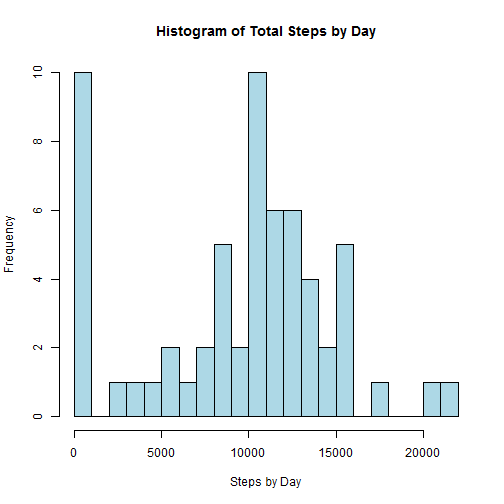
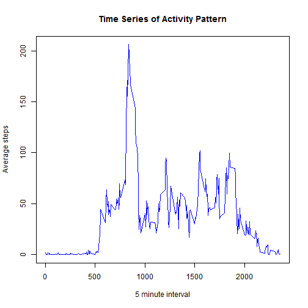
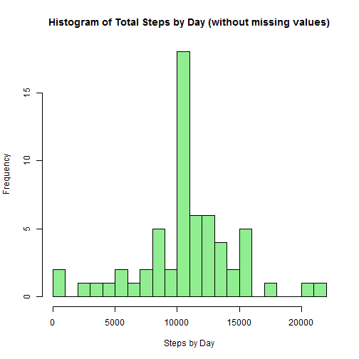
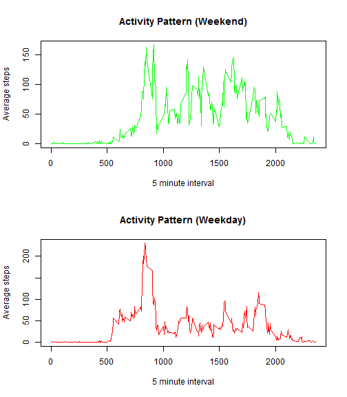

# Introduction #
Using data from activity monitoring devices, the goal of this assignment is to answer different question about this data with the help of the literate statistical programming *knitr* package.

## The Dataset ##
We'll use the [Activity Monitoring Data](https://d396qusza40orc.cloudfront.net/repdata%2Fdata%2Factivity.zip) dataset, previously downloaded in the working directory.

### Structure ###
The first view of the data (using a simple text editor) shows a CSV file with a simple structure. Here are the first three rows:

> "steps","date","interval"  
> NA,"2012-10-01",0  
> NA,"2012-10-01",5  

As we can see, there are three columns in the dataset (the first row shows the names):

* **Steps:** Number of steps in the 5 minutes interval
* **Date:** Date of the measure (in YYYY-MM-DD format)
* **Interval:** 5 minutes interval of each measure

It's noticed that the *steps* column has NA values.

### Loading the Data ###
We'll use the *dplyr* package to transform and filter the data. And we'll load it by using the *read.csv* function with the argument *header = TRUE*, as we know that the data has column names in the first row.


```r
library(dplyr, warn.conflicts= FALSE, quietly= TRUE)
actDS <- tbl_df(read.csv("activity.csv", header= TRUE))
```

### Some Initial Checks ###
To verify that the data is properly loaded, we can do some simple validations. We'll start by printing the first 5 rows of the data:

```r
head(actDS, 5)
```

```
## Source: local data frame [5 x 3]
## 
##   steps       date interval
##   (int)     (fctr)    (int)
## 1    NA 2012-10-01        0
## 2    NA 2012-10-01        5
## 3    NA 2012-10-01       10
## 4    NA 2012-10-01       15
## 5    NA 2012-10-01       20
```

We can notice that the date column is not typed as *date*:

```r
typeof(actDS$date)
```

```
## [1] "integer"
```

So we need to convert it:

```r
actDS$date <- as.Date(actDS$date)
```

# Questions #
Now, we have the dataset ready to analyze, so we start to answer the questions one by one.

## Number of Steps Taken per Day ##
To answer this question, we use again the functions of the *dplyr* library, grouping by *date* and summarising the data by the *steps* ignoring the *NA* values.

### Calculate of The Mean Steps per Day ###

```r
meanActbyDay <- actDS %>%
    group_by(date) %>%
    summarise(mean_steps= mean(steps, na.rm = TRUE))
```

To see the results in a convenient way, we can use the *xtable* library:

```r
library(xtable, warn.conflicts= FALSE, quietly= TRUE)
meanActbyDay$date <- as.character(meanActbyDay$date)
actTable <- xtable(meanActbyDay)
print(actTable, type= "html")
```

<!-- html table generated in R 3.2.1 by xtable 1.8-0 package -->
<!-- Sun Nov 15 21:40:02 2015 -->
<table border=1>
<tr> <th>  </th> <th> date </th> <th> mean_steps </th>  </tr>
  <tr> <td align="right"> 1 </td> <td> 2012-10-01 </td> <td align="right">  </td> </tr>
  <tr> <td align="right"> 2 </td> <td> 2012-10-02 </td> <td align="right"> 0.44 </td> </tr>
  <tr> <td align="right"> 3 </td> <td> 2012-10-03 </td> <td align="right"> 39.42 </td> </tr>
  <tr> <td align="right"> 4 </td> <td> 2012-10-04 </td> <td align="right"> 42.07 </td> </tr>
  <tr> <td align="right"> 5 </td> <td> 2012-10-05 </td> <td align="right"> 46.16 </td> </tr>
  <tr> <td align="right"> 6 </td> <td> 2012-10-06 </td> <td align="right"> 53.54 </td> </tr>
  <tr> <td align="right"> 7 </td> <td> 2012-10-07 </td> <td align="right"> 38.25 </td> </tr>
  <tr> <td align="right"> 8 </td> <td> 2012-10-08 </td> <td align="right">  </td> </tr>
  <tr> <td align="right"> 9 </td> <td> 2012-10-09 </td> <td align="right"> 44.48 </td> </tr>
  <tr> <td align="right"> 10 </td> <td> 2012-10-10 </td> <td align="right"> 34.38 </td> </tr>
  <tr> <td align="right"> 11 </td> <td> 2012-10-11 </td> <td align="right"> 35.78 </td> </tr>
  <tr> <td align="right"> 12 </td> <td> 2012-10-12 </td> <td align="right"> 60.35 </td> </tr>
  <tr> <td align="right"> 13 </td> <td> 2012-10-13 </td> <td align="right"> 43.15 </td> </tr>
  <tr> <td align="right"> 14 </td> <td> 2012-10-14 </td> <td align="right"> 52.42 </td> </tr>
  <tr> <td align="right"> 15 </td> <td> 2012-10-15 </td> <td align="right"> 35.20 </td> </tr>
  <tr> <td align="right"> 16 </td> <td> 2012-10-16 </td> <td align="right"> 52.38 </td> </tr>
  <tr> <td align="right"> 17 </td> <td> 2012-10-17 </td> <td align="right"> 46.71 </td> </tr>
  <tr> <td align="right"> 18 </td> <td> 2012-10-18 </td> <td align="right"> 34.92 </td> </tr>
  <tr> <td align="right"> 19 </td> <td> 2012-10-19 </td> <td align="right"> 41.07 </td> </tr>
  <tr> <td align="right"> 20 </td> <td> 2012-10-20 </td> <td align="right"> 36.09 </td> </tr>
  <tr> <td align="right"> 21 </td> <td> 2012-10-21 </td> <td align="right"> 30.63 </td> </tr>
  <tr> <td align="right"> 22 </td> <td> 2012-10-22 </td> <td align="right"> 46.74 </td> </tr>
  <tr> <td align="right"> 23 </td> <td> 2012-10-23 </td> <td align="right"> 30.97 </td> </tr>
  <tr> <td align="right"> 24 </td> <td> 2012-10-24 </td> <td align="right"> 29.01 </td> </tr>
  <tr> <td align="right"> 25 </td> <td> 2012-10-25 </td> <td align="right"> 8.65 </td> </tr>
  <tr> <td align="right"> 26 </td> <td> 2012-10-26 </td> <td align="right"> 23.53 </td> </tr>
  <tr> <td align="right"> 27 </td> <td> 2012-10-27 </td> <td align="right"> 35.14 </td> </tr>
  <tr> <td align="right"> 28 </td> <td> 2012-10-28 </td> <td align="right"> 39.78 </td> </tr>
  <tr> <td align="right"> 29 </td> <td> 2012-10-29 </td> <td align="right"> 17.42 </td> </tr>
  <tr> <td align="right"> 30 </td> <td> 2012-10-30 </td> <td align="right"> 34.09 </td> </tr>
  <tr> <td align="right"> 31 </td> <td> 2012-10-31 </td> <td align="right"> 53.52 </td> </tr>
  <tr> <td align="right"> 32 </td> <td> 2012-11-01 </td> <td align="right">  </td> </tr>
  <tr> <td align="right"> 33 </td> <td> 2012-11-02 </td> <td align="right"> 36.81 </td> </tr>
  <tr> <td align="right"> 34 </td> <td> 2012-11-03 </td> <td align="right"> 36.70 </td> </tr>
  <tr> <td align="right"> 35 </td> <td> 2012-11-04 </td> <td align="right">  </td> </tr>
  <tr> <td align="right"> 36 </td> <td> 2012-11-05 </td> <td align="right"> 36.25 </td> </tr>
  <tr> <td align="right"> 37 </td> <td> 2012-11-06 </td> <td align="right"> 28.94 </td> </tr>
  <tr> <td align="right"> 38 </td> <td> 2012-11-07 </td> <td align="right"> 44.73 </td> </tr>
  <tr> <td align="right"> 39 </td> <td> 2012-11-08 </td> <td align="right"> 11.18 </td> </tr>
  <tr> <td align="right"> 40 </td> <td> 2012-11-09 </td> <td align="right">  </td> </tr>
  <tr> <td align="right"> 41 </td> <td> 2012-11-10 </td> <td align="right">  </td> </tr>
  <tr> <td align="right"> 42 </td> <td> 2012-11-11 </td> <td align="right"> 43.78 </td> </tr>
  <tr> <td align="right"> 43 </td> <td> 2012-11-12 </td> <td align="right"> 37.38 </td> </tr>
  <tr> <td align="right"> 44 </td> <td> 2012-11-13 </td> <td align="right"> 25.47 </td> </tr>
  <tr> <td align="right"> 45 </td> <td> 2012-11-14 </td> <td align="right">  </td> </tr>
  <tr> <td align="right"> 46 </td> <td> 2012-11-15 </td> <td align="right"> 0.14 </td> </tr>
  <tr> <td align="right"> 47 </td> <td> 2012-11-16 </td> <td align="right"> 18.89 </td> </tr>
  <tr> <td align="right"> 48 </td> <td> 2012-11-17 </td> <td align="right"> 49.79 </td> </tr>
  <tr> <td align="right"> 49 </td> <td> 2012-11-18 </td> <td align="right"> 52.47 </td> </tr>
  <tr> <td align="right"> 50 </td> <td> 2012-11-19 </td> <td align="right"> 30.70 </td> </tr>
  <tr> <td align="right"> 51 </td> <td> 2012-11-20 </td> <td align="right"> 15.53 </td> </tr>
  <tr> <td align="right"> 52 </td> <td> 2012-11-21 </td> <td align="right"> 44.40 </td> </tr>
  <tr> <td align="right"> 53 </td> <td> 2012-11-22 </td> <td align="right"> 70.93 </td> </tr>
  <tr> <td align="right"> 54 </td> <td> 2012-11-23 </td> <td align="right"> 73.59 </td> </tr>
  <tr> <td align="right"> 55 </td> <td> 2012-11-24 </td> <td align="right"> 50.27 </td> </tr>
  <tr> <td align="right"> 56 </td> <td> 2012-11-25 </td> <td align="right"> 41.09 </td> </tr>
  <tr> <td align="right"> 57 </td> <td> 2012-11-26 </td> <td align="right"> 38.76 </td> </tr>
  <tr> <td align="right"> 58 </td> <td> 2012-11-27 </td> <td align="right"> 47.38 </td> </tr>
  <tr> <td align="right"> 59 </td> <td> 2012-11-28 </td> <td align="right"> 35.36 </td> </tr>
  <tr> <td align="right"> 60 </td> <td> 2012-11-29 </td> <td align="right"> 24.47 </td> </tr>
  <tr> <td align="right"> 61 </td> <td> 2012-11-30 </td> <td align="right">  </td> </tr>
   </table>

### Histogram of the Total Number of Steps per Day ###
First, we need to do some calcutations again:

```r
totalActbyDay <- actDS %>%
    group_by(date) %>%
    summarise(total_steps= sum(steps, na.rm = TRUE))
```

We can do the histogram now:

```r
hist(totalActbyDay$total_steps, 
     breaks= 30, 
     col= "lightblue", 
     main = "Histogram of Total Steps by Day", 
     xlab= "Steps by Day")
```

 

### Report of the Mean and Median of the Total Number of Steps per Day ###
We can show the mean and median using *mean()* and *median()* functions but, instead of doing this way, we can achieve same result in a more simple way:

```r
summary(totalActbyDay$total_steps)
```

```
##    Min. 1st Qu.  Median    Mean 3rd Qu.    Max. 
##       0    6778   10400    9354   12810   21190
```

We can see that the mean of the total number of steps is 9354.23 and the median is 10395.

## Average Daily Activity Pattern ##
Again, we need to do some calcutations to know what's the average interval across all days:

```r
meanActbyInterval <- actDS %>%
    group_by(interval) %>%
    summarise(mean_steps= mean(steps, na.rm = TRUE))
```

### Time Series Plot ###
We'll use the *base* plotting system again, because this is a simple graphic:

```r
plot(x= meanActbyInterval$interval, 
     y= meanActbyInterval$mean_steps, 
     type= "l", 
     col= "blue", 
     main= "Time Series of Activity Pattern", 
     xlab= "5 minute interval", 
     ylab= "Average steps")
```

 

### Maximum Number of Steps ###
We can see that the 835 interval is the highest one.

## Missing Values ##
There are an important number of missing values in the data. Until now, we ignoring it (for example, using *na.rm* attribute), but now we'll gonna see if they are introducing bias.

### Total Number of Missing Values ###
There are 2304 missing values *(NA)* in the *steps* column of the data.

### Strategy to Avoid Missing Values ###
In order to avoid all the bias in the data introduced by the existing missing values, we choose to replace it by the mean activity by interval (previously calculated).

### Create a New Data Set with NA Filled In ###

```r
cleanActDS <- actDS %>%
    inner_join(meanActbyInterval, by= "interval")
cleanActDS$steps[is.na(cleanActDS$steps)] <- cleanActDS$mean_steps[is.na(cleanActDS$steps)]
```

### Histogram of the Total Number of Steps per Day (without NAs) ###
In order to do that, we need some calcutations again:

```r
totalNewActbyDay <- cleanActDS %>%
    group_by(date) %>%
    summarise(total_steps= sum(steps, na.rm = TRUE))
```

We can do the new histogram:

```r
hist(totalNewActbyDay$total_steps, 
     breaks= 30, 
     col= "lightgreen", 
     main = "Histogram of Total Steps by Day (without missing values)", 
     xlab= "Steps by Day")
```

 

### Mean and Median of the Total Number of Steps per Day Without Missing Values ###
We can see that the new mean of the total number of steps is 10766.19 and the new median is 10766.19.

As we expected, we noted that the new mean and median values are slightly different from the above ones, because now we have a largest population with more repeated central values.

## Differences in Activity Patterns Between Weekdays and Weekends ##
### New Factor Variable ###
I noticed that *weekdays()* function returns the day of the week name in the local language, so, in order to allow reproducibility, I opted for use the *is.weekend()* function, which is part of the *chron* package:


```r
library(chron, warn.conflicts= FALSE, quietly= TRUE)
weekActDS <- cleanActDS
weekActDS$weekend <- NA
weekActDS$weekend[which(is.weekend(weekActDS$date))] <- "weekend"
weekActDS$weekend[which(!is.weekend(weekActDS$date))] <- "weekday"
weekActDS$weekend <- factor(weekActDS$weekend)
table(weekActDS$weekend)
```

```
## 
## weekday weekend 
##   12960    4608
```

### Time Series Panel Plot ###
First, the calcutations:

```r
meanWeekendActbyInterval <- weekActDS %>%
    filter(weekend == "weekend") %>%
    group_by(interval) %>%
    summarise(mean_steps= mean(steps, na.rm = TRUE))

meanWeekdayActbyInterval <- weekActDS %>%
    filter(weekend == "weekday") %>%
    group_by(interval) %>%
    summarise(mean_steps= mean(steps, na.rm = TRUE))
```

Now, the plots:

```r
par(mfrow= c(2, 1))

plot(x= meanWeekendActbyInterval$interval, 
     y= meanWeekendActbyInterval$mean_steps, 
     type= "l", 
     col= "green", 
     main= "Activity Pattern (Weekend)", 
     xlab= "5 minute interval", 
     ylab= "Average steps")

plot(x= meanWeekdayActbyInterval$interval, 
     y= meanWeekdayActbyInterval$mean_steps, 
     type= "l", 
     col= "red", 
     main= "Activity Pattern (Weekday)", 
     xlab= "5 minute interval", 
     ylab= "Average steps")
```

 

*(Sorry for my english, I hope you understand me anyway ;-)*
